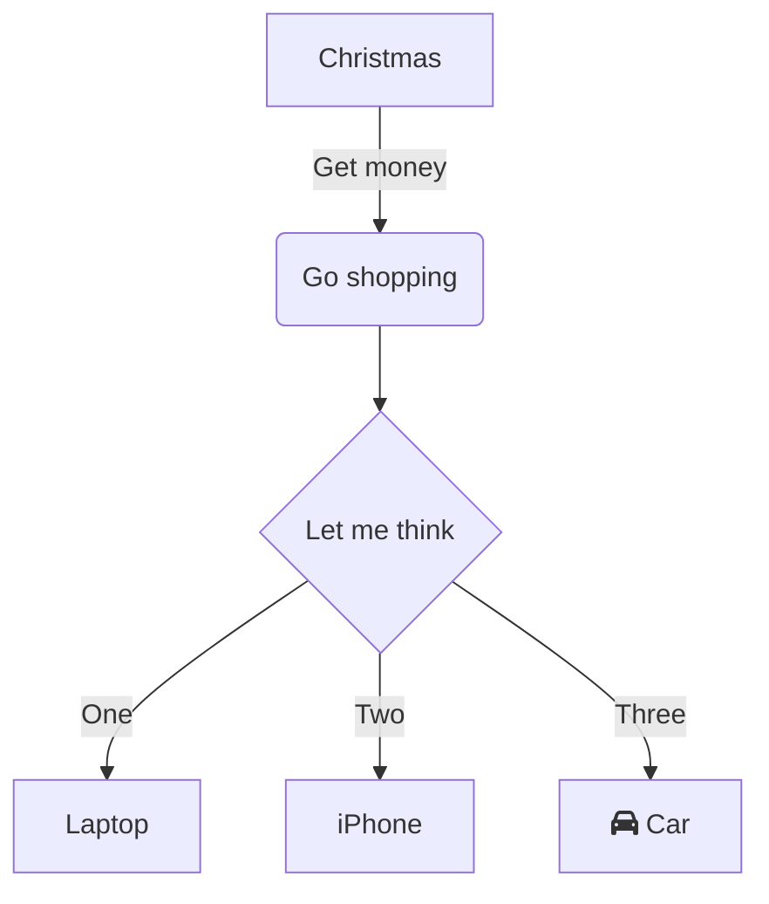
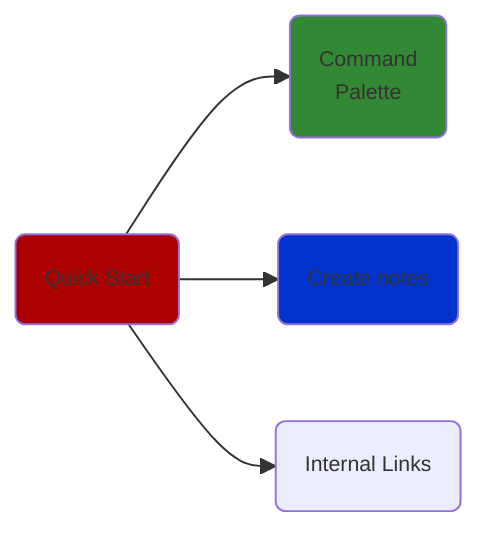
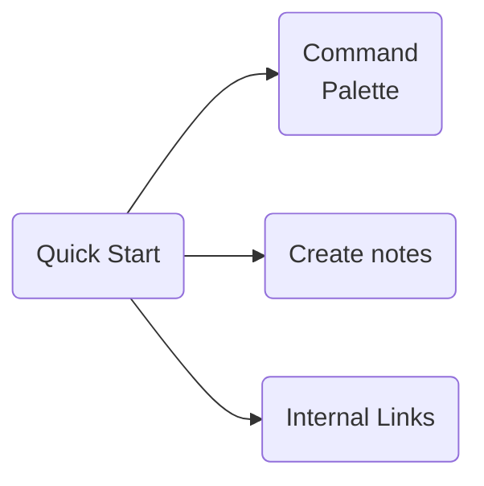
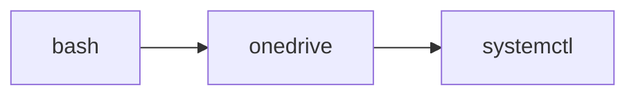

# Ticket Zimmer/Wochnungs Möbelplan
Ticket Zimmer/Wochnungs Möbelplan

Ticket für Zimmer/Wochnungs Möbelplan - Priorität: Mittel, Kategorie: Organisation, Ticket ID: T-001







```gantt
section Home
Shopping: shopping, 03-06, 5h

click shopping href "obsidian://vault/brain/shopping.md"
```

<h1>&#x2192</h1>
<center href="T-002 - Bett planen.md" class="internal-link">
tecz
</center>

<a href="my file.md" class="internal-link">my file</a>